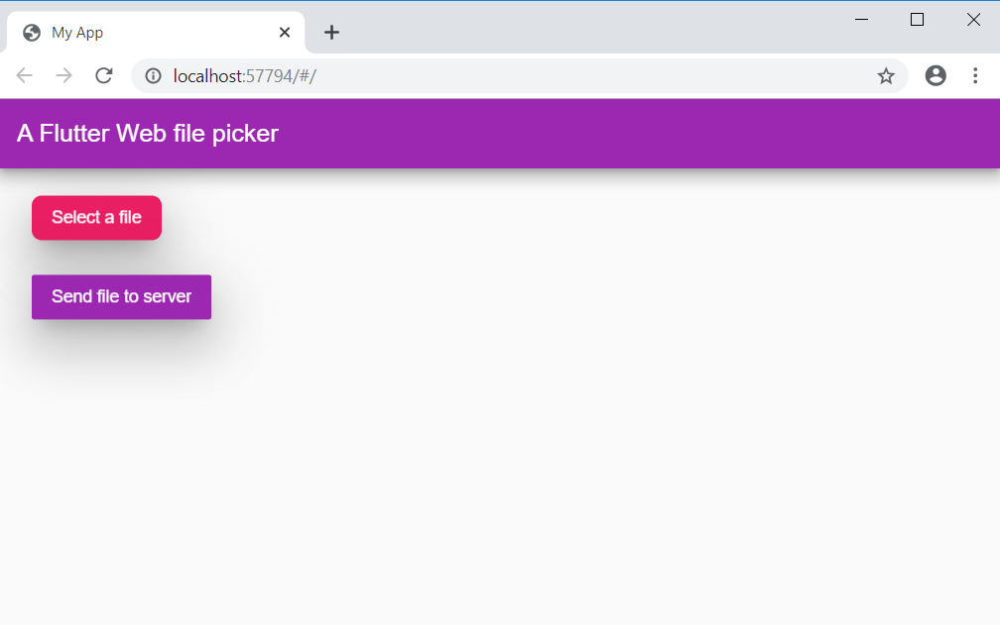

# Upload and Send an Image on Flutter Web

A Flutter web app that will let you upload an image and send it to an API endpoint that looks for a Multipart "image" file. For example, I used a Flask backend with command `requests.file.get("image")` to retrieve files from this app.

Thanks to this [amazing repository](https://github.com/rjcalifornia/web_upload) by [rjcalifornia](https://github.com/rjcalifornia) for the inspiration.

### Requirements

* Flutter Channel master version 1.12.5
* Android Studio version 3.5
* Visual Studio Code
* Dart SDK >=2.1.0 <3.0.0

### Dependencies

* Flutter cupertino localizations
* Flutter Cupertino Date Picker: ^1.0.12
* http: ^0.12.0+2

### Installation

* Clone this repository: `git clone https://github.com/btphan95/upload_image_flutter'
* Cd into repository folder: `cd upload_image_flutter` 
* Run flutter (for web, make sure you have [web enabled](https://flutter.dev/docs/get-started/web) and run: `flutter run`)
